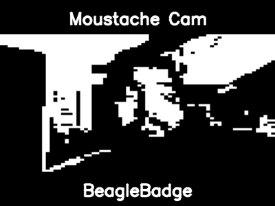

# BeagleBadgeCam

BeagleBadgeCam is a Python application that provides a Game Boy-style camera feed with a mustache overlay option. It's designed to be a fun, retro-style camera application.

## Sample Output

<p align="center">
  
</p>

## Features

*   **Game Boy Camera Effect:** The camera feed is processed to mimic the look of the original Game Boy camera, with a 2-bit color depth.
*   **Mustache Overlay:** Toggle a mustache overlay on detected faces by pressing the 'm' key.
*   **Adjustable Resolution:** Change the resolution of the camera feed using the `+` and `-` keys.
*   **Save Captures:** Save the current frame (including bezels) as a JPG image by pressing the spacebar.
*   **Bluetooth Printer Support (Linux only):** On Linux systems, the application can print the saved captures to a Phomemo thermal printer.

## Requirements

*   Python 3
*   OpenCV
*   NumPy
*   Bleak
*   phomemo-printer

### Virtual Environment

It is recommended to use a virtual environment to manage the project's dependencies.

1.  **Create a virtual environment:**

    ```bash
    python3 -m venv venv
    ```

2.  **Activate the virtual environment:**

    *   **macOS/Linux:**

        ```bash
        source venv/bin/activate
        ```

    *   **Windows:**

        ```bash
        venv\Scripts\activate
        ```

3.  **Install the required libraries:**

    ```bash
    pip install -r requirements.txt
    ```

## Usage

1.  **Run the application:**

    ```bash
    python3 main.py
    ```

2.  **Configure Bluetooth (optional):**

    If you're on Linux and want to use a Phomemo printer, the application will prompt you to scan for Bluetooth devices. Select your printer from the list to save its MAC address to the `config.json` file.

3.  **Controls:**

    *   `q`: Quit the application.
    *   `m`: Toggle the mustache overlay.
    *   `+`: Increase the camera resolution.
    *   `-`: Decrease the camera resolution.
    *   `space`: Save the current frame as a JPG image.
    *   `left arrow`: Decrease the black and white threshold.
    *   `right arrow`: Increase the black and white threshold.
    *   `r`: Rotate the camera input 90 degrees clockwise (press multiple times for full rotation)

## Configuration

The `config.json` file stores the following settings:

*   `resolution`: The initial resolution of the camera feed.
*   `bluetooth_mac_address`: The MAC address of your Phomemo printer (Linux only).
*   `bluetooth_channel`: The Bluetooth channel for your printer (usually 1).
